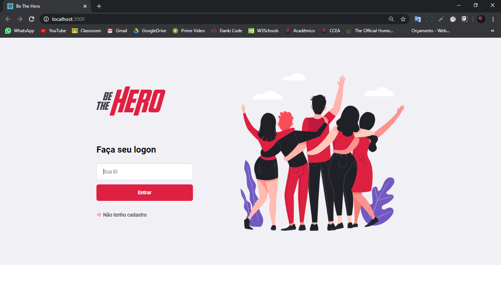
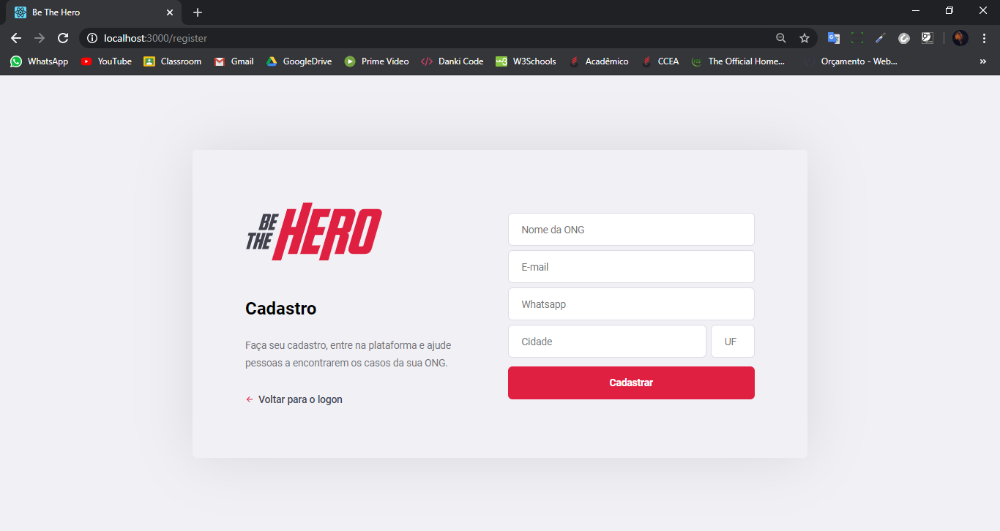
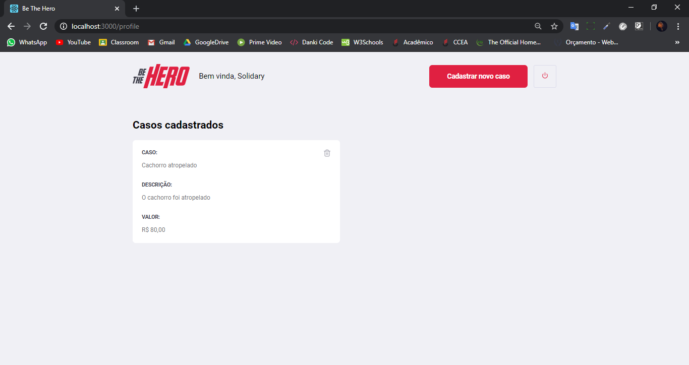
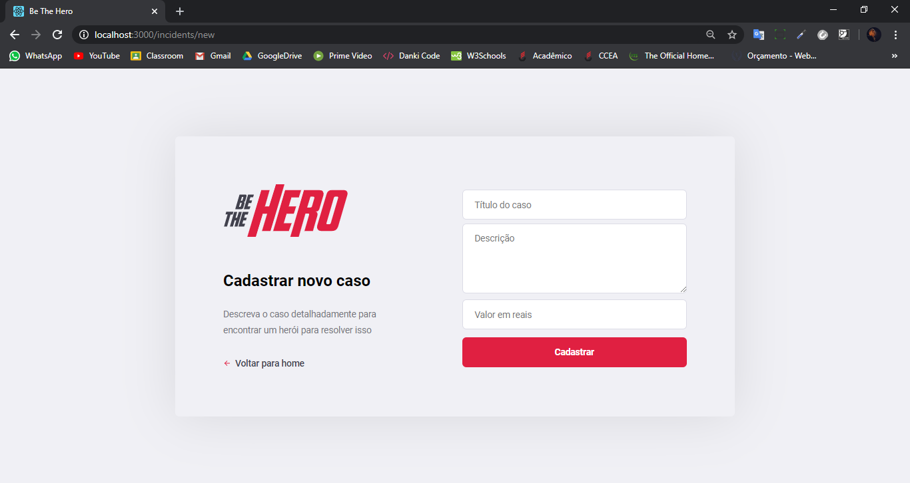
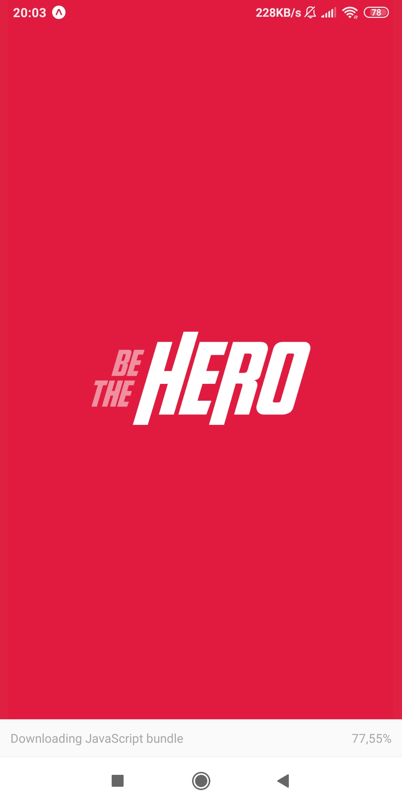
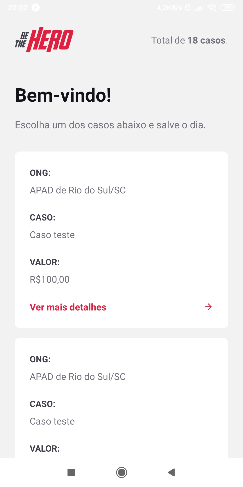
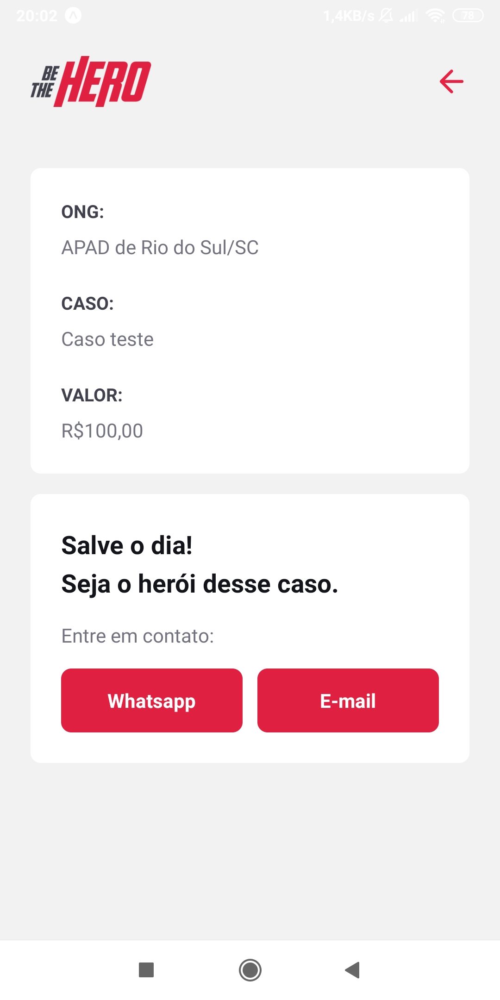
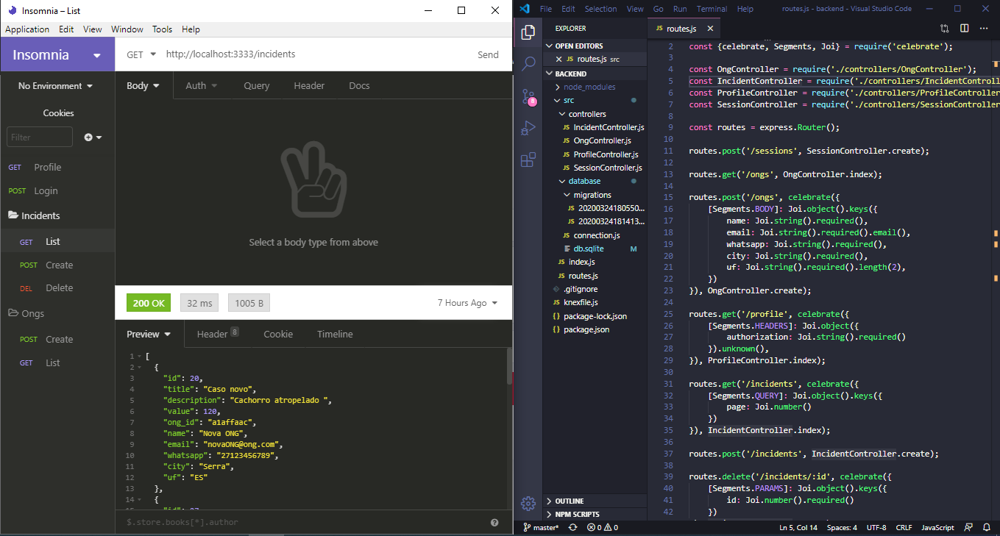

# Be The Hero
Aplicação com intuito de conectar pessoas interessadas em ajudar ONGS. Desenvolvida com Node.js, ReactJS e React Native.

### FRONT-END

### MOBILE

### BACK-END:

## :rocket: Tecnologias

<table>
  <thead>
    <th>Back-end</th>
    <th>Front-end</th>
    <th>Mobile</th>
  </thead>
  <tbody>
    <tr>
      <td>Node.js</td>
      <td>ReactJS</td>
      <td>React Native - Expo</td>
    </tr>
    <tr>
      <td>ExpressJs</td>
    </tr>
    <tr>
      <td>SqLite</td>
      <td>Axios</td>
      <td>Axios</td>
    </tr>
    <tr>
      <td>Nodemon</td>
    </tr>
    <tr>
      <td>Cors</td>
    </tr>
    <tr>
      <td>Knex</td>
    </tr>
  </tbody>
  
</table>

